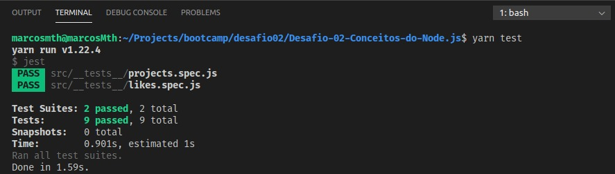

# Desafio-02-Conceitos-do-Node.js
Esse é o desafio 02 do bootcamp da Rocketseat (turma goStack11), sobre nodeJs.
### Objetivo
- Fazer uma aplicação para armazenar repositórios do seu portfólio, que irá permitir a criação, listagem, atualização e remoção dos repositórios, e além disso permitir que os repositórios possam receber "likes".

**OBS: Usando array para armazenar os repositórios.**

Logo após terminar a aplicação e ver os resultados no Insomnia, devemos executar o script test no terminal, para que ele possa 
verificar se passamos em todos os pontos do desafio!

Saída do teste:

**Rocketseat!! goStack11!! Desafio02 NodeJS!!**
